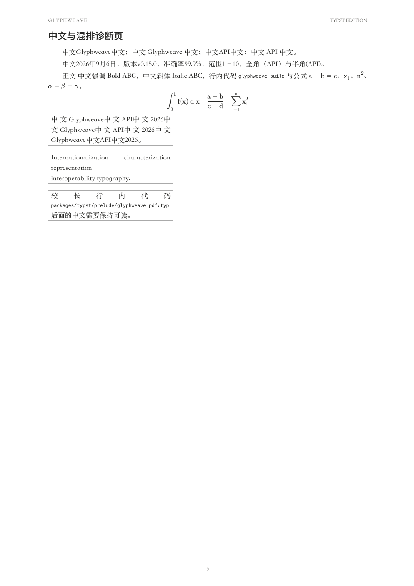
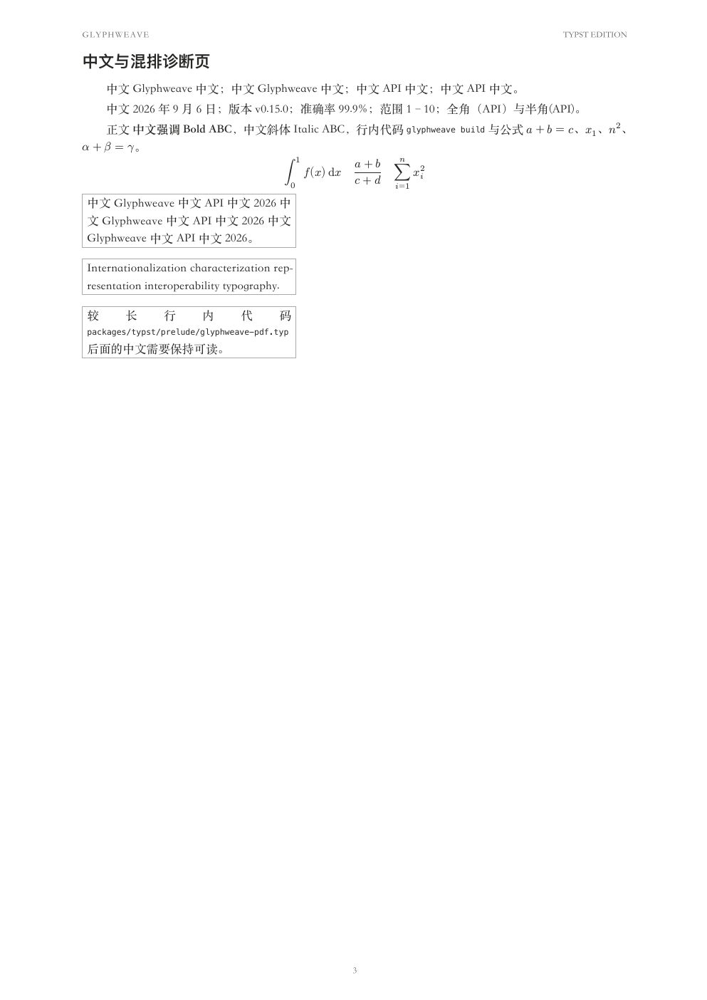

# Typst PDF 中文与混排检查及优化规划

> 后续实施已完成：见 [实施结果与验证](IMPLEMENTATION.md)。本文保留实施前的研究状态与实验数据，生产配置以实施报告和使用文档为准。

检查日期：2026-09-06。代码基线：`b3f7291`。本轮范围是代码审计、视觉检查、隔离实验与方案规划；没有修改生产模板、配置或既有测试。

后续完善：[PDF 排版规范与参数方案 v2](TYPOGRAPHY-SPEC.md)。新增现行行业规范与 CLREQ 草案的适用性核对、字体角色/真实字重方案、45 组行高度量，以及具体字号、间距和验收矩阵。实施规划以 v2 为准，本文保留首轮视觉证据。

最优先的问题是全局 ASCII 字符的盒子包装：它在修正纵向位置的同时，破坏了中文与英文之间的自动间距、英文断词和数学字形。建议先替换这一实现，再对字体与阅读密度做独立比较。宋体正文、黑体标题、编号、列表标记、代码行号等已有设计继续作为基线。

## 1. 检查对象与方法

- 审阅 `packages/typst/prelude/glyphweave-pdf.typ` 全部规则、`compiler.ts` 包装逻辑、schema 配置、core 参数传递、字体环境指纹与 Pages 工作流。
- 回看模板历史，尤其是 `efc6284`、`a3957ea`、`93084f7`、`17ef5fa`、`f8c0c9f`、`f6b7b07`。
- 本机 Typst **0.15.0**，macOS，实际 PDF 字体包含 `STSongti-SC-Regular/Bold`、`PingFangSC-Semibold`、`Menlo-Regular/Bold`、`NewCMMath-Book`，示例 SVG 另含 Arial。
- 完整检查源旁旧 PDF 的 3 页。其无当前模板的页眉页码、标题编号和代码背景，不把它当作当前导出基线。
- 使用当前模板包装综合 demo，生成 A/B/C 三组 PDF，各为 **2 页文章 + 1 页诊断页**；Poppler 120dpi 渲染后检查全文，并用 Typst `measure` 获取宽度。
- A 为当前模板；B 只把全局 `box(move(...))` 改成 `text(baseline: ...)`；C 只删除这条全局规则。其余规则完全保留，包括 raw 和行内公式自己的 baseline 补偿。
- `pnpm exec vitest run tests/pdf-template.test.ts`：2/2 通过。但这些测试主要检查源码字符串，无法证明排版正确。

本轮没有重新运行整套发布流水线，也没有在 Linux 重做字体视觉检查。缺失的 Noto CJK 后备字体在本机产生 warning；已确认本机有宋体、苹方并实际用于 PDF，不能把这类 warning 直接等同于中文缺字。

## 2. 从已有迭代中保留什么

| 既有变化 | 代码/历史证据 | 后续约束 |
| --- | --- | --- |
| 从无衬线转向宋体正文 | `efc6284`；当前字体栈 | 保留中文长文的宋体方向，避免仅因新字体流行就整体替换 |
| 英文下移 0.04em | `a3957ea`；模板第 78 行 | 保留改善混排基线的意图，替换有副作用的盒子实现 |
| 所有标题统一 13.5pt、主标题不编号 | `93084f7` | 不直接恢复早期 20pt 以上大标题；若调整层级，先比较字重及上下留白 |
| MiSans 引入后回退 | `589ff08`、`17ef5fa` | 不把 MiSans 当默认新方案；提交没有说明回退原因，不推断是质量或授权问题 |
| Pages 安装并检查 Noto CJK/DejaVu | `f8c0c9f`；setup-typst 与 Pages workflow | 保留 Linux 字体检查，并补实际字形/页面回归 |
| 列表标记、缩进、行内代码/公式补偿 | `f6b7b07` | 第一阶段不改这些参数，避免把多个变量叠加后误判效果 |

模板已经提供了宋体正文、黑体标题、克制配色、浅色代码底、细线表格、图注、页眉页码。当前问题应从局部机制修正入手。

## 3. 已复现的问题

### P0：全局盒子破坏混排间距和数学字形

位置：`packages/typst/prelude/glyphweave-pdf.typ:78`。

```typst
show regex("[A-Za-z0-9]+"): it => box(move(dy: 0.04em, it))
```

这不是纯视觉偏移：匹配到的文字变成独立行内盒子。规则还会匹配公式中的拉丁字符。

10pt 宋体、同一诊断文本、同一字体环境下的实测：

| 指标 | A 当前盒子 | B 文本 baseline 0.04em | C 无全局补偿 |
| --- | ---: | ---: | ---: |
| `中文ABC中文` 宽度 | 59.32pt | 64.32pt | 64.32pt |
| `中文 ABC 中文` 宽度 | 64.32pt | 64.32pt | 64.32pt |
| 独立测量中文与 ABC 的宽度之和 | 59.32pt | 59.32pt | 59.32pt |
| 自动边界间距合计 | 0pt | 5pt | 5pt |
| `$a+b=c$` 宽度 | 40.56pt | 39.86pt | 39.86pt |
| 180pt 窄栏英文，显式 en + hyphenate | 3 行，无断词 | 2 行，正常断词 | 2 行，正常断词 |

因此，“源码是否手工加空格”在 A 中造成不同阅读效果；B/C 恢复每个中西文边界 2.5pt 的间距。公式中 A 的 `a、b、c、x、n` 呈直立字形，B/C 恢复数学斜体；不是仅凭公式宽度推断。

建议的最小候选是：

```typst
show regex("[A-Za-z0-9]+"): set text(baseline: 0.04em)
```

这只是已验证核心问题的候选，不是可以直接发布的最终规则。后续需限制补偿适用范围，检查标题、脚注、raw、公式等环境，避免与各自补偿重复作用；不要宣称统一 0.04em 适合所有字体。Typst 官方提供文字 baseline 与 CJK-Latin spacing 参数，字体依序按字形覆盖匹配：[text 文档](https://typst.app/docs/reference/text/text/)。

### P1：长行内代码仍然把短中文行拉得很散

位置：模板第 114–117 行。行内 raw 整体放入不可拆的盒子，配合全局两端对齐。

诊断页 180pt 窄栏中的 `packages/typst/prelude/glyphweave-pdf.typ` 会单独占一行，上一行“较长行内代码”的汉字被明显拉开。B/C 仍复现，说明修复全局 ASCII 包装并不能解决这个独立问题。普通 raw 与正文的排版默认行为不同，可参见 [raw 文档](https://typst.app/docs/reference/text/raw/)。

规划：短标识符保留紧凑外观及现有基线；对长路径、URL、长命令定义可断行策略，优先在 `/`、`.`、`-` 等边界探索可选断点，同时验证复制文本不变。特别长的命令应允许块级展示。不要通过不断缩小字号或全局加大 tracking 掩盖问题。

### P1：字体与字号层级需要在机制修复后评估

代码事实：正文 10pt，行内代码 8.6pt，代码块 7.6pt，表格 8.4pt，图注 7.8pt；A4 版心宽约 459.21pt，约等于 46 个 10pt 全角字。

视觉判断：当前宋体笔画较细，适页查看时正文、图注及代码显得偏小；标题相对突出，阅读字号的落差比配色问题更明显。这是本机观察，不是所有显示器上的客观结论。

字体栈按优先级选择，并不会自动给中文和英文选择经过协调的一对字体。当前本机正文的拉丁文也来自宋体。诊断页中的普通 `_Italic ABC_` 在 A/B/C 中都没有明显斜体变化，不能归咎于盒子一条规则；后续需核对字体可用样式与强调策略。

此外，`heading-fonts` 存在于 Typst 模板，却没有通过 schema、`TypstPdfWrapperOptions`、core 和 compiler 暴露，因此用户只改正文栈时仍可能保留平台相关的标题字体。

规划：保留现有 macOS 阅读风格作为 A；增加固定版本的跨平台 Noto Serif CJK SC / Noto Sans CJK SC / DejaVu Sans Mono 样张作为 B。拉丁字体拆分作为 C 单独实验，连带检查中文标点、数字、字重和数学，不默认接受所有字符统一偏移。

### P2：标题、分页、结构块需要压力样例

当前标题统一 13.5pt，二级和三级标题主要靠编号区分。这是历史上的主动选择，尚不能判定为 bug。若层级导航仍弱，先测试有限的字重/间距差异，保留主标题不编号与章节编号方式。

`show figure` 总是 `breakable: false`，而 demo 的 table 又包在 figure 中；长表可能因此失去正常跨页能力。当前短表没有复现溢出，应作为待验证风险，而非已发生缺陷。需要 40 行以上表格、重复表头、长图注、接近满页图片和页末标题样例。

短表第 1 行使用 semibold、但仍是宋体；不要把字重请求当作实际存在的中等字重字体。统一 2em 首行缩进与段距也要覆盖列表内多段、引文、脚注，而不只看普通正文。

## 4. 推荐实施顺序与验收

### 第一阶段：机制修复

只调整 ASCII 包装策略；原字体、10pt 正文、0.8em leading、列表缩进、标题字号及 raw/公式补偿保持基线。先采用 B 进行扩大验证，C 始终保留为对照。

验收：

1. 同字体下，有/无手工空格的诊断串宽度一致，精度容差 0.01pt；自动边界间距与原生 C 一致。
2. en + hyphenate 窄栏恢复正常断词；普通技术标识符不错误拆分。
3. 公式数学斜体、上下标、分数及运算符间距与 C 一致；另检查普通文本、标题、代码、脚注的纵向位置。
4. 完整文章逐页复核，不以页数更少或“无编译错误”替代视觉判断。本轮三组文章均为 2 页，但页界位置已有变化。
5. 在 macOS 和 Pages Linux 字体组合上各跑一次，保留 PDF 字体清单与渲染图。

### 第二阶段：字体与阅读密度

先确定字体组合，再单变量比较正文 10 / 10.5 / 11pt。v2 的实际测量显示，10.5pt 宋体的 0.8em leading 只产生约 1.495 倍行高，降到 0.72em 会进一步变紧；因此不再优先缩小 leading，改为对照实际行高 1.50 / 1.60 / 1.65 / 1.70 倍，并按字体校准。最后再考虑段距与版心，不同时改所有参数。详见 [v2 的行高方案](TYPOGRAPHY-SPEC.md#5-行间距与段间距以实际行高为验收对象)。

比较标准：适页与 100% 缩放下的中文辨识、英文与中文的视觉大小/粗细、代码可读性、实际每行字数、段落灰度、页末留白、整篇翻页负担。字号候选是实验范围，尚未验证优于当前值。

工程落点：schema 增加受约束的标题字体/排版 profile 配置；types、core 传递、compiler 参数序列化与模板同步，保持已有配置兼容。不要一开始把所有 em 常量都暴露为公共配置。

### 第三阶段：长内容与视觉回归

增加长代码、URL、40 行表格、多页引用、复杂行内公式、纯英文段、全中文长段、无空格混排、中文标点行首行尾、列表内多段、字重与斜体样例。

测试分两层：结构/度量断言用于间距、断词与文本完整性；固定编译器和字体的页面截图用于字形、字号、错位与裁切。跨操作系统不直接做逐像素完全相等比较。

当前测试明确锁定了 `box(move(dy: 0.04em, it))` 字符串，应改为验证目标行为，避免要求已知有问题的实现必须存在。现有版本、字体嵌入、缓存检查继续保留：`fingerprint.ts` 已哈希 prelude；`environment.ts` 已纳入编译器和字体字节，不能误报为“模板/字体变化不触发缓存更新”。

发布前再运行受影响单测、真实编译集成测试和 Pages 字体验证，同步中英文使用文档与模板版本记录。每阶段单独提交，能够独立回退。

## 5. 对照图与复现

下图是完整诊断页。图中末尾窄栏故意保留长代码造成的坏例子，不能把候选图理解为最终排版成品。

当前规则：



保留 0.04em 下移、改用 text baseline 的候选：



运行：

```sh
python3 docs/reports/pdf-typography-2026-09-06/reproduce.py
```

脚本需要 PATH 中的 Typst 0.15.0、pdftoppm 和本机字体；输出到新的临时目录，保留三组 PDF、逐页 PNG、warning 日志、模板哈希与 `metrics.json`。脚本读取本目录冻结的 `baseline.typ`，不读取已优化的生产模板；基线规则不匹配时中止。`probe.typ` 为本轮诊断样例；`observed-metrics.json` 为本轮保存的原始度量。

限制：本轮确认的是局部机制缺陷及本机视觉结果，尚未完成跨平台字体优选、最终字号选择、长表分页修复或正式视觉回归接入。
